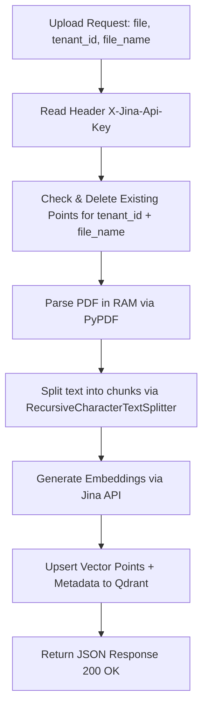

# System Architecture Document

## 📌 Project Title
**Stateless Multi-Tenant AI Chat Support Engine**

---

## 1. High-Level System Architecture

The system is designed as a **completely stateless Python 3.10+ FastAPI backend**. It handles multi-tenant document ingestion and retrieval-augmented generation (RAG) chat queries without keeping local databases, persistent disk caches, or tenant API keys.

```
                               ┌──────────────────────────────────────────────┐
                               │           Incoming HTTP Request              │
                               │                                              │
                               │  Headers:                                    │
                               │   - X-Jina-Api-Key                           │
                               │   - X-LLM-Api-Key                            │
                               │   - X-LLM-Provider (gemini|openai|groq)      │
                               │                                              │
                               │  Payload:                                    │
                               │   - tenant_id                                │
                               │   - file (PDF) OR query + system_prompt      │
                               └──────────────────────┬───────────────────────┘
                                                      │
                                                      ▼
                                       ┌──────────────────────────────┐
                                       │    FastAPI Gateway Server    │
                                       └──────────────┬───────────────┘
                                                      │
                       ┌──────────────────────────────┴──────────────────────────────┐
                       │                                                             │
                       ▼                                                             ▼
            ┌─────────────────────┐                                       ┌─────────────────────┐
            │   /ingest Router    │                                       │    /chat Router     │
            └──────────┬──────────┘                                       └──────────┬──────────┘
                       │                                                             │
            Extract PDF in RAM                                            Embed Query (Jina API)
                       │                                                             │
            Chunking & Vectorization                                      Filtered Vector Search
             (Jina Embeddings API)                                         (Qdrant tenant_id)
                       │                                                             │
                       ▼                                                             ▼
          ┌─────────────────────────┐                                   ┌─────────────────────────┐
          │    Qdrant Vector DB     │◄──────────────────────────────────┤    Qdrant Vector DB     │
          │ (Single Collection +    │                                   │ (Top-K Matches Fetched) │
          │ tenant_id Keyword Index)│                                   └────────────┬────────────┘
          └─────────────────────────┘                                                │
                                                                           Assemble Dual Prompt
                                                                           (Base + Client Context)
                                                                                     │
                                                                                     ▼
                                                                        ┌─────────────────────────┐
                                                                        │  Dynamic LLM Factory    │
                                                                        │(OpenAI / Gemini / Groq) │
                                                                        └─────────────────────────┘
```

---

## 2. Component Architecture & Responsibilities

### 2.1 FastAPI Server & Routers (`routers/`)
* **`routers/ingest.py`**: Handles PDF upload, in-memory stream conversion, automatic deletion of old vectors for the same `(tenant_id, file_name)`, chunk vectorization via Jina, and storage in Qdrant.
* **`routers/documents.py`**: Manages document listings (`GET /documents`) and document/tenant deletion (`DELETE /documents`).
* **`routers/chat.py`**: Accepts user queries, generates query embeddings, retrieves filtered Qdrant context, composes prompts, and invokes dynamic LLM providers.

### 2.2 Core Service Layer (`services/`)
* **`qdrant_service.py`**:
  * Initializes the Qdrant connection using env variables (`QDRANT_URL`, `QDRANT_API_KEY`).
  * Enforces startup creation of the single Qdrant collection (default: `multitenant_chat_support`).
  * Creates and maintains a **Keyword Payload Index** on `tenant_id`.
  * Executes filtered vector search, document scroll (for listing), and deletion.
* **`embedding_service.py`**:
  * Wraps Jina Embeddings API calls via LangChain `JinaEmbeddings`.
  * Accepts `X-Jina-Api-Key` dynamically per request.
* **`pdf_service.py`**:
  * Accepts binary PDF byte streams from FastAPI `UploadFile`.
  * Reads pages in-memory using `PyPDF` / `pdfplumber`.
  * Uses LangChain `RecursiveCharacterTextSplitter` (chunk size: 800, overlap: 100).
* **`llm_service.py`**:
  * Dynamic factory pattern for LLM initialization based on headers:
    - Provider `openai` -> `ChatOpenAI(api_key=..., model=model_name)`
    - Provider `gemini` -> `ChatGoogleGenerativeAI(google_api_key=..., model=model_name)`
    - Provider `groq` -> `ChatGroq(api_key=..., model=model_name)`

---

## 3. Qdrant Multi-Tenancy & Indexing Design

### 3.1 Single Collection Architecture
To minimize infrastructure overhead and memory footprint, all tenants share a single Qdrant collection (`multitenant_chat_support`).

### 3.2 Payload Schema
Every vector payload stored in Qdrant contains:
```json
{
  "tenant_id": "acme_corp",
  "file_name": "user_guide.pdf",
  "chunk_index": 4,
  "page_number": 2,
  "text": "To reset your password, navigate to Account Settings..."
}
```

### 3.3 Keyword Indexing for Sub-Millisecond Search
Upon server startup, FastAPI executes a lifespan context manager to guarantee that `tenant_id` is indexed as a `KEYWORD` field:

```python
# Startup Initialization in qdrant_service.py
client.create_payload_index(
    collection_name="multitenant_chat_support",
    field_name="tenant_id",
    field_schema=PayloadSchemaType.KEYWORD,
)
```

### 3.4 Query Filter Enforcement
Every search query sent to Qdrant applies a strict boolean filter matching `tenant_id`:

```python
search_filter = Filter(
    must=[
        FieldCondition(
            key="tenant_id",
            match=MatchValue(value=tenant_id)
        )
    ]
)
```

---

## 4. Ingestion & Auto-Update Sequence

When a tenant uploads a document with an existing `file_name`:
1. **Pre-Ingest Cleanup**: Execute Qdrant delete operation matching `tenant_id == X AND file_name == Y`.
2. **RAM Extraction**: Read PDF byte stream into memory (`io.BytesIO`).
3. **Text Chunking**: Split document into semantic text blocks.
4. **Batch Embedding**: Pass chunks to Jina Embeddings API using request header `X-Jina-Api-Key`.
5. **Upsert Points**: Write new vectors + metadata payload into Qdrant.



---

## 5. RAG Pipeline & Dual System Prompt Framing

### 5.1 Prompt Construction Strategy
The engine enforces strict grounding using a two-tier system prompt structure:

```
┌────────────────────────────────────────────────────────────────────────┐
│ SERVER BASE SYSTEM PROMPT                                               │
│ "You are a customer support AI assistant. Answer using ONLY context.  │
│  If answer is missing, respond with 'I do not have enough info.'"     │
└───────────────────────────────────┬────────────────────────────────────┘
                                    │
                                    ▼
┌────────────────────────────────────────────────────────────────────────┐
│ CLIENT CUSTOM INSTRUCTIONS (Optional)                                  │
│ "Sign off as 'ACME Support'. Use a friendly, polite tone."              │
└───────────────────────────────────┬────────────────────────────────────┘
                                    │
                                    ▼
┌────────────────────────────────────────────────────────────────────────┐
│ RETRIEVED CONTEXT CHUNKS (From Qdrant Filtered by tenant_id)            │
│ [Doc: return_policy.pdf, Page 1]: "Returns accepted within 30 days..."  │
└───────────────────────────────────┬────────────────────────────────────┘
                                    │
                                    ▼
┌────────────────────────────────────────────────────────────────────────┐
│ CONVERSATION HISTORY + CURRENT USER QUERY                              │
│ User: "How long do I have to return an item?"                         │
└────────────────────────────────────────────────────────────────────────┘
```

### 5.2 Citation Tracking
Each context chunk retrieved from Qdrant includes its metadata (`file_name`, `page_number`, `score`). These are attached to the API output under the `sources` field.

---

## 6. Directory & Code Base Layout

```
ChatSupport/
├── 00_docs/
│   ├── PRD.md                 # Product Requirements Document
│   └── ARCHITECTURE.md        # System Architecture Document (This File)
│
└── app/                       # Project Root for Application Code & Environment
    ├── api/
    │   └── v1/
    │       ├── __init__.py
    │       ├── chat.py        # POST /api/v1/chat
    │       ├── documents.py   # GET /api/v1/documents, DELETE /api/v1/documents
    │       └── ingest.py      # POST /api/v1/ingest
    │
    ├── core/
    │   ├── __init__.py
    │   ├── config.py          # Settings, Qdrant URL, Default Base System Prompt
    │   └── exceptions.py      # Custom HTTP exception handlers (401, 404, 502)
    │
    ├── models/
    │   ├── __init__.py
    │   ├── request.py         # ChatRequest, DocumentDeleteRequest Pydantic models
    │   └── response.py        # ChatResponse, DocumentListResponse Pydantic models
    │
    ├── services/
    │   ├── __init__.py
    │   ├── embedding_service.py # Jina Embeddings wrapper
    │   ├── llm_provider.py    # Dynamic LLM vendor factory (Gemini, OpenAI, Groq)
    │   ├── pdf_service.py     # In-memory PDF text extraction & chunking
    │   └── vector_db.py       # Qdrant client, payload indexing & tenant search
    │
    ├── utils/
    │   ├── __init__.py
    │   └── logger.py          # Logger with header API key masking/redaction
    │
    ├── tests/
    │   ├── __init__.py
    │   └── test_api.py        # Pytest suite for endpoints
    │
    ├── .env                   # Local Environment Variables
    ├── .example.env           # Environment Variables Template
    ├── main.py                # FastAPI entrypoint (uvicorn main:app)
    └── requirements.txt       # Python 3.10+ dependencies
```

---

## 7. Security & Operational Policies

1. **Stateless Credential Handling**:
   - No API keys are persisted in environment variables or databases.
   - Header tokens are passed directly to SDK constructors per request scope and garbage-collected after response delivery.
2. **Log Redaction**:
   - FastAPI logging middleware explicitly filters out sensitive headers (`X-Jina-Api-Key`, `X-LLM-Api-Key`).
3. **RAM Memory Hygiene**:
   - Binary PDF byte buffers are closed and freed immediately after text extraction.
