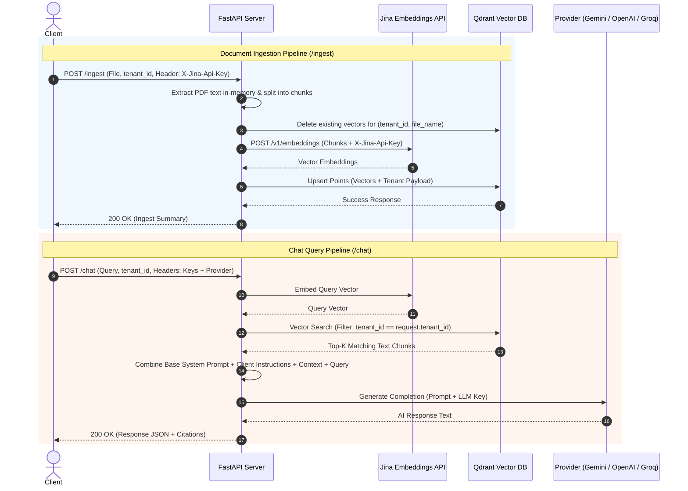

# Product Requirements Document (PRD)

## 📌 Project Title
**Stateless Multi-Tenant AI Chat Support Engine**

---

## 1. Executive Summary & Vision

The **Stateless Multi-Tenant AI Chat Support Engine** is a high-performance Python FastAPI backend service designed to deliver retrieval-augmented generation (RAG) chat support for multiple tenants without persisting tenant credentials, LLM keys, or document files locally.

By shifting tenant credentials, provider choices, and system prompts to per-request HTTP headers and payloads, the engine remains 100% stateless. It leverages **Qdrant** as a vector database (using payload filtering for tenant isolation), **Jina Embeddings API** for semantic text chunk vectorization, and dynamic LLM provider adapters (**Google Gemini**, **OpenAI**, and **Groq**) for response generation.

---

## 2. Problem Statement & Goals

### 2.1 Problem Statement
Building traditional SaaS multi-tenant chat support systems requires managing complex tenant databases, secure key vaults, stateful session servers, and background document pipelines. This increases operational complexity, compliance risks, and infrastructure overhead.

### 2.2 Product Goals
* **Zero Local Persistence**: No local database for tenant API keys or uploaded PDFs; all processing happens in-memory and in Qdrant.
* **Seamless Multi-Tenancy**: Support thousands of tenants in a single vector database collection with strict sub-millisecond payload filtering (`tenant_id`).
* **Provider Agnostic**: Allow clients to dynamically choose their LLM vendor (`gemini`, `openai`, `groq`) per API call by passing vendor keys in request headers.
* **Full Document Lifecycle**: Enable tenants to upload, list, overwrite, and delete knowledge base PDFs by filename.
* **Strict Grounding**: Provide reliable answers based strictly on tenant documentation, backed by a default base system prompt with fallback mechanisms when information is missing.

---

## 3. Core Features & Functional Requirements

### FR-1: Request-Level Stateless Authentication & Provider Routing
* **FR-1.1**: The system must extract vendor API keys and provider selections strictly from HTTP request headers:
  * `X-Jina-Api-Key`: API key for Jina Embeddings.
  * `X-LLM-Api-Key`: API key for the chosen LLM service.
  * `X-LLM-Provider`: Selected LLM vendor (`openai` | `gemini` | `groq`).
* **FR-1.2**: API keys must **never** be written to disk, server logs, or persistent configuration files.

### FR-2: Multi-Tenant Vector Database Strategy
* **FR-2.1**: A single Qdrant collection (default: `multitenant_chat_support`) shall hold all tenant embeddings.
* **FR-2.2**: A **Keyword Payload Index** must be created automatically on the `tenant_id` field upon server startup.
* **FR-2.3**: Every Qdrant point payload must store:
  ```json
  {
    "tenant_id": "string",
    "file_name": "string",
    "chunk_index": "integer",
    "page_number": "integer",
    "text": "string"
  }
  ```

### FR-3: Document Ingestion Pipeline (`POST /ingest`)
* **FR-3.1**: Accept multipart PDF uploads along with `tenant_id` and optional `file_name`.
* **FR-3.2**: Process PDF files completely in RAM (`io.BytesIO`) using PyPDF without writing temporary files to disk.
* **FR-3.3**: Split text into semantic chunks using `RecursiveCharacterTextSplitter` (default: 800 characters, 100 overlap).
* **FR-3.4**: If vectors matching `tenant_id` AND `file_name` already exist, delete old vectors prior to inserting new ones (Auto-Update).
* **FR-3.5**: Vectorize chunks via **Jina Embeddings API** and upsert to Qdrant.

### FR-4: Document Management CRUD (`GET /documents` & `DELETE /documents`)
* **FR-4.1 (`GET /documents`)**: Retrieve a distinct list of all uploaded `file_name` entries and chunk counts registered under a given `tenant_id`.
* **FR-4.2 (`DELETE /documents`)**: Allow deleting a specific document by `(tenant_id, file_name)` or wiping all documents under `tenant_id` (`delete_all=true`).

### FR-5: RAG Chat System & Prompt Composition (`POST /chat`)
* **FR-5.1**: Generate query vector via Jina Embeddings API using the request's `X-Jina-Api-Key`.
* **FR-5.2**: Perform Qdrant vector similarity search filtered by `tenant_id` (top-K results, default K=4).
* **FR-5.3**: **System Prompt Hierarchy**:
  * Include a built-in **Default Base System Prompt** enforcing strict grounding ("If the answer is not in the context, state that you do not have enough information").
  * If the request body contains a client `system_prompt`, append it as additional behavioral rules.
* **FR-5.4**: Dynamically instantiate the requested LLM (`openai`, `gemini`, `groq`) using the provided `X-LLM-Api-Key` and pass the context, conversation history, and query.
* **FR-5.5**: Return a structured JSON response containing the generated answer and cited text source chunks.

---

## 4. API Endpoints Specification

### 4.1 `POST /api/v1/ingest`
* **Headers**: `X-Jina-Api-Key`
* **Body (Multipart/Form-Data)**:
  * `file`: Binary PDF file.
  * `tenant_id`: String (e.g. `"tenant_acme"`).
  * `file_name`: String (Optional, defaults to original PDF filename).
* **Success Response (200 OK)**:
  ```json
  {
    "status": "success",
    "tenant_id": "tenant_acme",
    "file_name": "product_manual.pdf",
    "chunks_processed": 18,
    "message": "Document successfully ingested and indexed."
  }
  ```

---

### 4.2 `GET /api/v1/documents`
* **Query Parameters**: `tenant_id` (String, required)
* **Success Response (200 OK)**:
  ```json
  {
    "tenant_id": "tenant_acme",
    "total_documents": 2,
    "documents": [
      {
        "file_name": "product_manual.pdf",
        "total_chunks": 18
      },
      {
        "file_name": "return_policy.pdf",
        "total_chunks": 5
      }
    ]
  }
  ```

---

### 4.3 `DELETE /api/v1/documents`
* **Query Parameters**: `tenant_id` (required), `file_name` (optional), `delete_all` (boolean, default false)
* **Success Response (200 OK)**:
  ```json
  {
    "status": "success",
    "tenant_id": "tenant_acme",
    "message": "Successfully deleted document 'product_manual.pdf'."
  }
  ```

---

### 4.4 `POST /api/v1/chat`
* **Headers**:
  * `X-Jina-Api-Key`: String
  * `X-LLM-Api-Key`: String
  * `X-LLM-Provider`: `"gemini"` | `"openai"` | `"groq"`
* **Body (JSON)**:
  ```json
  {
    "tenant_id": "tenant_acme",
    "query": "What is the return policy duration?",
    "system_prompt": "Answer in a warm tone and sign off as 'ACME Support Team'.",
    "model_name": "llama-3.3-70b-versatile",
    "top_k": 4,
    "conversation_history": [
      { "role": "user", "content": "Hi there!" },
      { "role": "assistant", "content": "Hello! How can I help you today?" }
    ]
  }
  ```
* **Success Response (200 OK)**:
  ```json
  {
    "response": "Returns are accepted within 30 days of purchase with original receipt. Best regards, ACME Support Team.",
    "sources": [
      {
        "file_name": "return_policy.pdf",
        "page_number": 1,
        "text": "All items can be returned within 30 days of delivery...",
        "score": 0.88
      }
    ]
  }
  ```

---

## 5. Technical Architecture & Data Flow



---

## 6. Non-Functional & Security Requirements

1. **Security & Data Isolation**:
   - Strict filter evaluation on Qdrant: queries *must* enforce `tenant_id` filtering.
   - Zero storage of vendor API keys or PDF contents on local server file system.
2. **Performance & Scalability**:
   - Sub-500ms total context retrieval latency using indexed Qdrant payload search.
   - Batch embedding calls to Jina to reduce network round-trips during PDF ingestion.
3. **Resilience & Fault Tolerance**:
   - Catch and translate third-party vendor errors (e.g. invalid API key, quota limits) into clear HTTP status codes (401 Unauthorized, 429 Rate Limit, 502 Bad Gateway).

---

## 7. Technology Stack Summary

* **Language & Web Framework**: Python 3.10+, FastAPI, Uvicorn
* **Orchestration**: LangChain (`langchain-core`, `langchain-community`, `langchain-openai`, `langchain-google-genai`, `langchain-groq`)
* **Vector Database**: Qdrant (`qdrant-client`)
* **Embeddings**: Jina Embeddings API (`jina-embeddings-v2-base-en` or `v3`)
* **PDF Engine**: PyPDF / LangChain Document Loaders
* **LLM Providers**: Google Gemini, OpenAI, Groq

---

## 8. Release Plan & Phasing

* **Phase 1 (Current Scope)**: Complete stateless core server with `/ingest`, `/documents` (CRUD), and `/chat` (JSON response).
* **Phase 2 (Future Enhancement)**: Add Server-Sent Events (SSE) streaming support for `/chat`.
* **Phase 3 (Future Enhancement)**: Add Hybrid Search (Dense vector + Sparse keyword search via Qdrant BM25).
